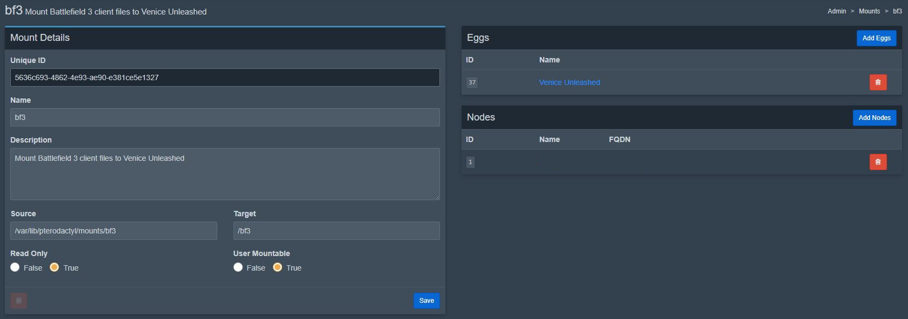
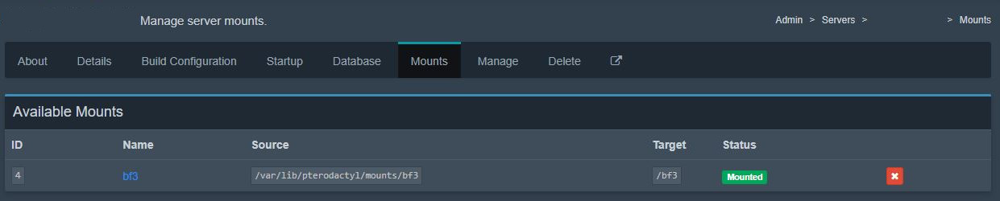

# Venice Unleashed

### Authors / Contributors

<!-- prettier-ignore-start -->
<!-- markdownlint-disable -->
<table>
    <tr>
        <td align="center">
            <a href="https://github.com/redthirten">
                <br /><sub><b>Red-Thirten</b></sub>
            </a>
            <br />
            <a href="https://github.com/pelican-eggs/games-standalone/commits?author=redthirten" title="Codes">💻</a>
            <a href="https://github.com/pelican-eggs/games-standalone/commits?author=redthirten" title="Maintains">🔨</a>
        </td>
    </tr>
</table>
<!-- markdownlint-enable -->
<!-- prettier-ignore-end -->

___

### Game Description

From the Venice Unleashed [Website](https://veniceunleashed.net/):
> Venice Unleashed (VU) is a community-oriented Battlefield 3 custom server & modding platform that gives you back control of your gaming experience.

___

### Installation/System Requirements

> [!IMPORTANT]
> This Egg requires the use of the panel's ***Mounts*** system to mount a ***legal*** copy of Battlefield 3's client files into the server. This reduces the need to store a copy of BF3 per server instance. Instructions are provided under [Server Setup](#server-setup).

|  | Bare Minimum | Recommended |
|---------|---------|---------|
| Processor | Dual Core x86 @ 3GHz or better | Favours higher single-core performance over multiple cores, because the executable is limited to a single thread. |
| RAM | 1024 MiB | 4096 MiB (VU will never use more than 4 GiB because it is a 32-bit application) |
| Storage | 1536 MiB per server & ~35 GiB on the host node to store one copy of BF3 client files for mounting. | More may be required if using a lot of mods. |
| Network | 5 Mbit/s | 30 Mbit/s |
| Host OS | Most stable Linux OS branches should work. | Using the latest kernel version for your installed OS can prevent some edge-case installation/boot issues. |
| Game Ownership | Vanilla Battlefield 3 (only vanilla maps/gear will work) attached to an EA Account (Steam is OK if linked). | Battlefield 3 Premium (all DLC maps/gear will be available) attached to an EA Account (Steam is OK if linked). |
| Accounts / Keys | A Venice Unleashed Account is required and must be linked to EA/Origin Account. Also, a server key must be generated & downloaded from Venice Unleashed [key management portal](https://veniceunleashed.net/keys). | --- |

> [!WARNING]
> If you wish to have the server publicly accessible ***and*** accessible via LAN ***and*** your server is on a different subnet from your LAN client (eg. a VLAN setup), you must own a domain name that points to your public IP address. See [Joining the Server](#joining-the-server) for more info.

___

### Server Ports

| Port | Default | Protocol | Required |
|---------|---------|---------|---------|
| **Frostbite networking layer (Primary)** | 25200 | UDP | **Yes** |
| Monitored Harmony, the VU networking layer | 7948 | UDP | **Yes** |
| RCON | 47200 | TCP | No |

___

### Server Setup

It is recommended to do the following steps in order:

#### 1. Obtain your EA Auth Token

Hosting a VU server requires authorization with your EA login token to authenticate that you own a legal copy of BF3. The easiest way to obtain this token is to:
1. Install and launch the EA App on your personal computer.
2. Install the VU client.
3. Search for the "Activate BF3" shortcut in your Windows Start Menu (added by VU; see [the docs](https://docs.veniceunleashed.net/hosting/setup-win/#activating-the-game) for alternative method if shortcut is missing).
4. Run this shortcut and copy the long token value it provides to a safe place.

> [!CAUTION]
> EA Auth Tokens can be used to freely access the corresponding EA account, bypassing passwords and 2FA! This token is required by the Egg and stored as a Startup Variable in **plain text**. Be mindful of associated security concerns regarding this.

It is up to you if you want panel clients to provide their own tokens, or if you want to edit the Egg to hide the "EA Auth Token" Startup Variable from view and use your own master "host" token for all servers. If you do the latter, it shouldn't be easy for clients to see your token, but it is still recommended not to use a personal EA account that could be potentially stolen (ie. create an account specifically for hosting that just owns BF3).

> [!NOTE]
> Tokens can sometimes rotate or become invalid over time. If you have trouble starting the server, you may need to regenerate your token and enable the "[Repair] Reactivate on Start" Startup Variable.

#### 2. Setup BF3 Mount

> [!NOTE]
> Screenshots are of the Pterodactyl panel, but the setup should be identical for Pelican.

1. Ensure you have an allowed mount directory configured for (and accessible by) your Wings node(s). This can be done by adding something like the following to your Wings `config.yml` and rebooting Wings:
```yml
allowed_mounts:
  - /var/lib/<pelican\pterodactyl>/mounts
```
2. Download a legal copy of Battlefield 3 on your personal computer and open up its installation location (eg. via EA App: `C:\Program Files\EA Games\Battlefield 3`).
3. Copy all of the files/folders in this directory (the one containing `bf3.exe`) to any host nodes you would like to host this Egg on. It should be copied to a new folder named `bf3` in your allowed mount directory (eg. `/var/lib/<pelican\pterodactyl>/mounts/bf3`).
4. In the admin panel, navigate to the "Mounts" tab and create a new mount like the following:

    Be sure to:
    1. Set the "Target" to `/bf3`.
    2. Add the Venice Unleashed Egg to the mount.
    3. Add any associated Nodes that you copied the files to.

    This mount can now be used for any new VU servers on those nodes.
5. Create a new VU server instance on your panel and *do not* have it automatically start after installation. After installation completes, navigate to the "Mounts" tab in the admin view of the server. Add the mount to the server like this:


#### 3. Obtain/Install your VU `server.key` file

1. Obtain and download a key file from Venice Unleashed [key management portal](https://veniceunleashed.net/keys).
2. Upload this file to your VU server instance under `/home/container/vu/instance`

#### 4. Authenticate server with EA

Start the server. Assuming you followed steps 1-3 correctly, the server should automatically authenticate itself with EA on the first boot.

Assuming it authenticated successfully, the server should start normally! 😃

> [!NOTE]
> It can take some time for the server to start while it works to connect to the Zeus backend for server listing.

___

### Joining the Server

In most cases, joining the server is as easy as finding it in the server list and clicking connect.

However, **if you are connecting to a server on your LAN from a different subnet**, the server browser will try to connect you to your public IP address, which will not work. Unfortunately, VU does not support directly connecting to an IP address; you must connect through their backend via the server's GUID. The following is a workaround for this issue:

1. Configure the "[Host] Join Host" Startup Variable. The domain you set will be what the VU server list provides as the connection address to clients. If you only want LAN connections, a fake domain like `myvuserver.com` is fine.
2. Do ***one*** of the following:
    1. Configure the hosts file on your client machine to redirect your configured domain to the local IP of the server.
    2. Configure your router's DNS Resolver to redirect your configured domain to the local IP of the server.

___

### Console Commands

Unfortunately, because the server executable must be wrapped in Wine, entering commands via the Panel do nothing.

Instead, it is recommended to use [Procon](https://myrcon.net/files/file/29-procon-client/) and connect via the RCON port. Vanilla BF3 commands can be found [here](https://github.com/dcodeIO/BattleCon/blob/master/eadocs/BF3/BF3%20PC%20Server%20Remote%20Administration%20Protocol.pdf), and VU-specific commands can be found [here](https://docs.veniceunleashed.net/hosting/commands/).

> [!WARNING]
> Procon was written for vanilla BF3 servers and not VU. Therefore, some of it's features/settings will not work with VU (namely Punkbuster settings/actions because it is disabled, and reserved slots).

___

### Known Errors/Warnings

The following error you see in the console can safely be ignored (memory addresses may be different):

```log
wine: Unhandled page fault on read access to 000000B8 at address 1000653A (thread 01e8), starting debugger...
```
